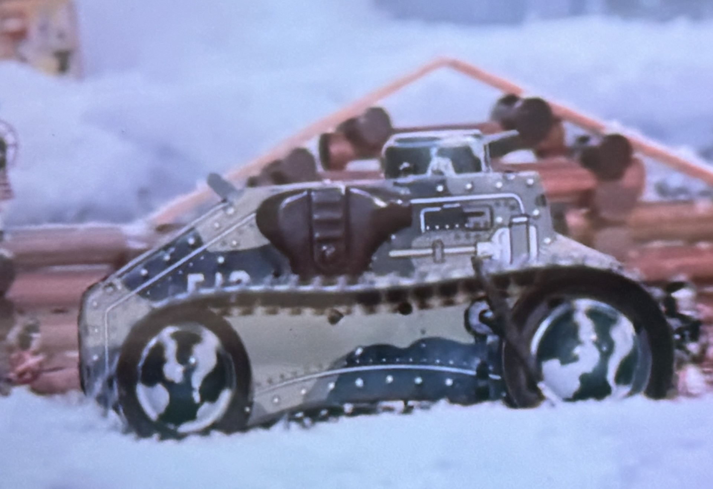

# 📖 Day 25: On this last day of OSINT

- CTF: 25 Days of Christmas Capture the Flag.
- Organized by: [OSMOSIS Association](https://osmosisinstitute.org/).
- Release Date: December 25, 2024.
- Points: 500.

**Challenge:** The image depicted is that of a "tin toy tank." It comes from a movie where it is showcased as one of the newest and best gifts of the year. While the story took place in the 40's in America, what year was the film released?

One attempt only.

`FLAG{9999}`

## ✍🏻 Write-Up

- Based on consultations with ChatGPT:

> Thank you for sharing the image. The "tin toy tank" in the image appears to be from a movie that nostalgically portrays America in the 1940s, showcasing the tank as a popular or prized holiday gift. These types of toys were often associated with World War II-era themes, reflecting both the design and culture of that time. If you'd like, I can help identify the movie or provide more context about tin toys of that era—just let me know!
>
> The movie you're referring to is likely **"A Christmas Story," released in 1983**. Set in the 1940s, the film follows young Ralphie Parker, who dreams of receiving a Red Ryder BB gun for Christmas. In one scene, Ralphie and his brother excitedly unwrap their presents, which include various popular toys of the era. Among these is a tin wind-up toy tank, reflecting the types of gifts cherished by children during that time.

- Part of the film can be viewed in this [clip](https://youtu.be/r3mkWGQCPZE?list=PLvd_ek64K66fOG7hcdbyMdA-vVisFw5Ya), where the toy tank appears at 3:21.
- Both the [Wikipedia page](https://en.wikipedia.org/wiki/A_Christmas_Story) and the [IMBb listing](https://www.imdb.com/title/tt0085334/?ref_%3Dref_ext_justwatch) confirm that the movie was released in 1983. 

## 🏁 Flag

`FLAG{1983}`. **Solved on:** December 25, 2024.