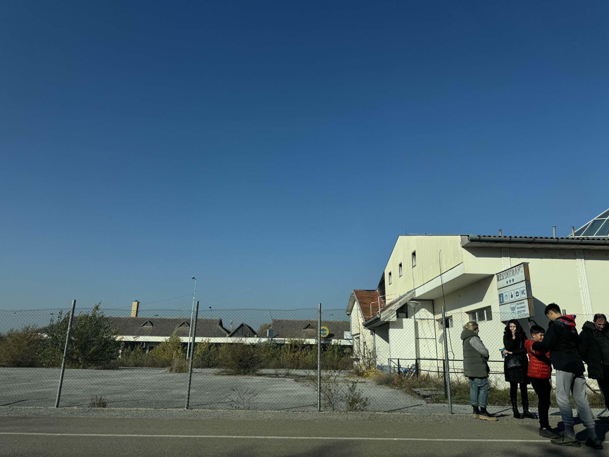
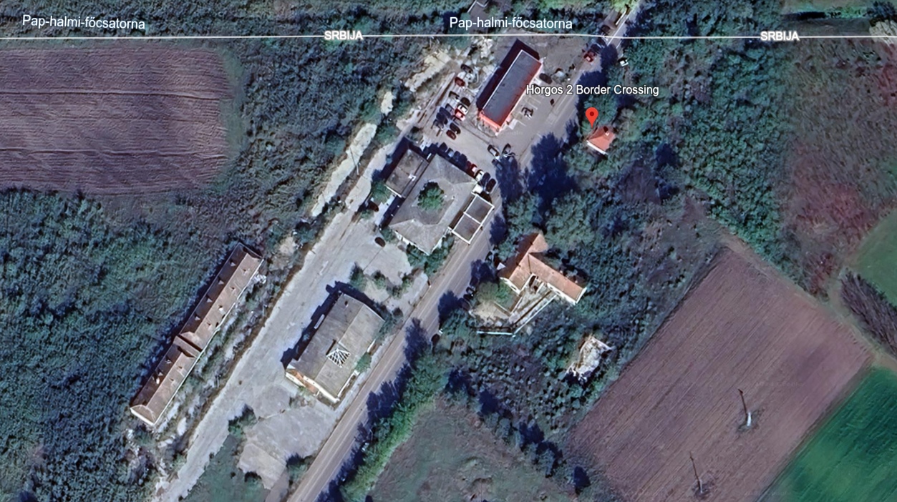

# 📖 Contestant Contributor: A Holiday Gift

- CTF: 25 Days of Christmas Capture the Flag.
- Organized by: [OSMOSIS Association](https://osmosisinstitute.org/).
- Release Date: December 20, 2024.
- Points: 100.

**Challenge:** Name the border crossing where Santa was stuck for four hours.

`FLAG{Xxxxxx X}`

Credit @Jessica Jones Questions direct to her on discord.

## ✍🏻 Write-Up

- This challenge required an exhaustive search for border crossing names that matched the flag format, followed by validation using Google Earth.
- A clue in the image revealed the words "exchange," "insurance," and "spedition." While the first two words are English, "spedition" originates from German (according to research conducted via ChatGPT).
- This led to an investigation of border crossings in European countries (as I couldn’t find the solution in Germany, Austria, or Switzerland), ultimately culminating in the discovery of this [document](https://www.asmap.ru/upload/Closed%20borders%20Serbia%2013.03.20.pdf).
- The document provides information on closed border crossings between Serbia and neighboring countries. At the very beginning of the document, the answer to this challenge can be found: the **Horgoš 2** border crossing between Serbia and Hungary.
- The image below, obtained via Google Earth, validates this identification due to the structural similarities with the provided photo.

## 🔎 Supporting Evidence

- I acknowledge that I might not have used the most efficient strategy to solve this challenge.
- An alternative approach could have involved geolocation tools such as [GeoGPT-AI](https://www.yeschat.ai/gpts-9t55QZdKjT7-GeoGPT).
    - By analyzing the image and linking it to potential countries, the tool could generate a list of possible locations.
    - Among the responses, the following statement was highlighted: "While Romania is my strongest guess, it could also potentially be in a nearby country like Bulgaria, **Hungary**, or **Serbia**. For a more precise identification, a readable name or sign detail would be necessary."
    - Although not definitive, this response could have significantly guided my investigation and potentially led to a faster solution.

## 🏁 Flag

`FLAG{Horgos 2}`. **Solved on:** December 21, 2024.