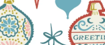

# 📖 Day 9.1: On the Ninth Day of OSINT .1

- CTF: 25 Days of Christmas Capture the Flag.
- Organized by: [OSMOSIS Association](https://osmosisinstitute.org/).
- Release Date: December 9, 2024.
- Points: 65.

**Challenge:** 🎄 Oh no! Santa’s workshop is in trouble! One of the elves misplaced a roll of very special wrapping paper meant for the most important gift of the season. Santa only has a small snippet of the wrapping paper design left, and he needs your help to track down where it’s sold. 🎅

`FLAG{Xxxxxxxxx Xxxxx Xxxxxxx}`

## ✍🏻 Write-Up

- Google Lens was initially used, but it did not provide any relevant results.
- A thorough Google search was conducted using the keywords: `ornamental gift wrap company`.
- This [search](https://www.google.com/search?q=ornamental+gift+wrap+company&sca_esv=63c7668e472ab9a2&udm=2&biw=2560&bih=939&ei=Sa5XZ-L_FOKf5NoPptry2QU&ved=0ahUKEwiiyJq5mpyKAxXiD1kFHSatPFsQ4dUDCBA&uact=5&oq=ornamental+gift+wrap+company&gs_lp=EgNpbWciHG9ybmFtZW50YWwgZ2lmdCB3cmFwIGNvbXBhbnlIjyBQrRNY_x1wBHgAkAEAmAH-AqABphaqAQMzLTi4AQPIAQD4AQGYAgCgAgCYAwCIBgGSBwCgB-gC&sclient=img#vhid=61ka6WguxK5cMM&vssid=mosaic) led to the identification of the wrapping paper sold by the [Waterleaf Paper Company](https://waterleafpaperco.com/products/mid-century-ornaments-wrapping-paper).

## 🏁 Flag

`FLAG{Waterleaf Paper Company}`. **Solved on:** December 10, 2024.