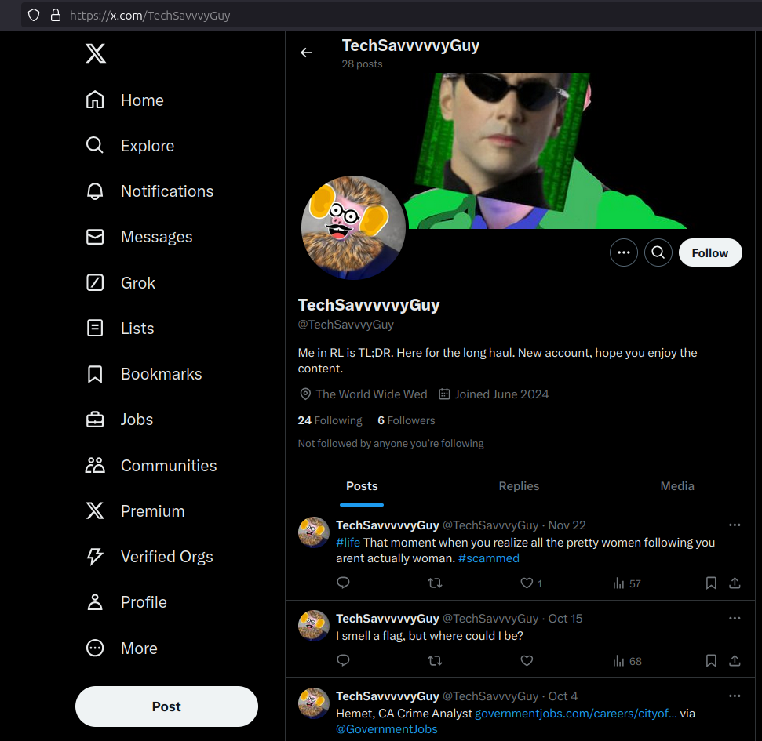
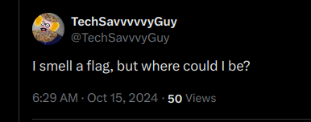

# 📖 Day 9.2: On the Ninth Day of OSINT .2

- CTF: 25 Days of Christmas Capture the Flag.
- Organized by: [OSMOSIS Association](https://osmosisinstitute.org/).
- Release Date: December 9, 2024.
- Points: 60.

**Challenge:** When did the individual depicted in the photo announce publicly that the smelled a flag?

`FLAG{H:MM MM/DD/YY}`

## ✍🏻 Write-Up

- The user [TechSavvvvvyGuy](https://x.com/TechSavvvyGuy) was identified on X (formerly Twitter).
- In my local timezone, they [posted](https://x.com/TechSavvvyGuy/status/1846121277251022972) the message:
    - `I smell a flag, but where could I be?` at **6:29 AM on October 15,2024**.
- However, it is critical to note that this timestamp reflects my local timezone and may not correspond to the actual time of the post in the original timezone.
- Additionally, [TechSavvvvvyGuy](https://x.com/TechSavvvyGuy) is featured in this [YouTube video](https://youtu.be/iVixAQ-2FFY) on the channel [Mr OSINT](https://www.youtube.com/@Misterosint).

## 🔎 Supporting Evidence

## 🏁 Flag

The correct flag is `FLAG{5:29 10/15/24}`. **Solved on:** December 10, 2024.