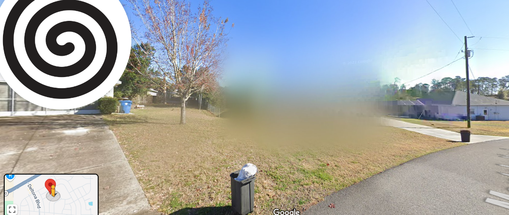

# 📖 Day 10: On the Tenth Day of OSINT

- CTF: 25 Days of Christmas Capture the Flag.
- Organized by: [OSMOSIS Association](https://osmosisinstitute.org/).
- Release Date: December 10, 2024.
- Points: 100.

**Challenge:** What is the address of the blurred home?

Flag format: `FLAG{9999 XXXXXXXXXX XX}`e.g., `FLAG{1234 Example Ln}`

## ✍🏻 Write-Up

- The street/highway name "Deltona Blvd" can be identified in the image.
- Using Google Maps, I matched the map segment in the image to a specific location.
- On [Google Street View](https://www.google.com.br/maps/@28.5185545,-82.5593035,3a,75y,45.86h,76.45t/data=!3m7!1e1!3m5!1sN6gPoQJMthgtYFquyHMpxg!2e0!6shttps:%2F%2Fstreetviewpixels-pa.googleapis.com%2Fv1%2Fthumbnail%3Fcb_client%3Dmaps_sv.tactile%26w%3D900%26h%3D600%26pitch%3D13.549999999999997%26panoid%3DN6gPoQJMthgtYFquyHMpxg%26yaw%3D45.86!7i16384!8i8192?entry=ttu&g_ep=EgoyMDI0MTIwOC4wIKXMDSoASAFQAw%3D%3D), I confirmed the address as **9545 Montebello Ln**.

## 🔎 Supporting Evidence

- Additional references to the address were found online:
    - [Redfin](https://www.redfin.com/FL/Spring-Hill/9545-Montebello-Ln-34608/home/139096737).
    - [Trulia](https://www.trulia.com/home/9545-montebello-ln-spring-hill-fl-34608-66711407).
    - [Homes.com](https://www.homes.com/property/9545-montebello-ln-spring-hill-fl/wc6enrxxtblwd/).

## 🏁 Flag

`FLAG{9545 Montebello Ln}`. **Solved on:** December 10, 2024.