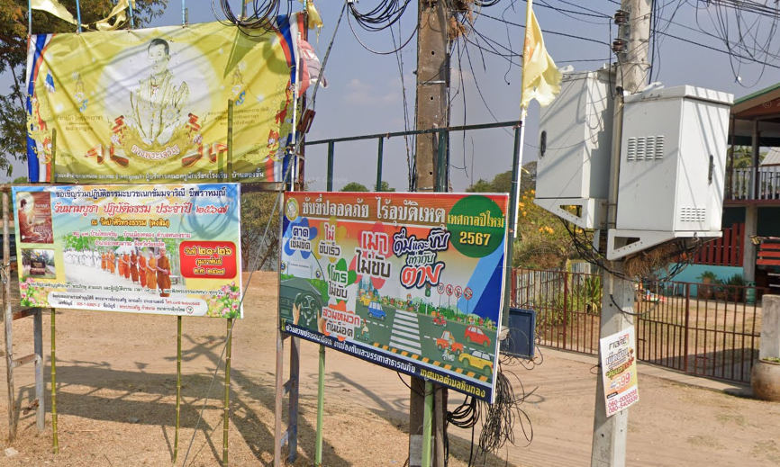

# 📖 Day 11: On the Eleventh Day of OSINT

- CTF: 25 Days of Christmas Capture the Flag.
- Organized by: [OSMOSIS Association](https://osmosisinstitute.org/).
- Release Date: December 11, 2024.
- Points: 75.

**Challenge:** If you want to pay merit, you can use the account number provided and send the money to what bank?

`FLAG{Xxxxxxxx Xxxx}`

## ✍🏻 Write-Up

- The poster in the image contains a partial account number: "060-000(...)".
- It is evident that the account number consists of at least 10 digits.
- Based on the language in the poster, the characters appear to be in Thai.
- A thorough investigation into Thai banks revealed no universal account number format, as different banks in Thailand use distinct patterns.
- Research indicates that the first three digits of an account number typically correspond to the bank's branch code ([source](https://aseannow.com/topic/964524-thai-bank-accounts-number-of-digits/)).
- Further investigation uncovered two references ([link01](https://www.tigerbay.com/en/how-to-order-and-payment) and [link02](https://www.tripadvisor.com.au/ShowUserReviews-g1215781-d29017918-r978726323-Seedcar-Phuket_Town_Phuket.html)) associating account numbers beginning with "060" to **Kasikorn Bank**.

## 🏁 Flag

`FLAG{Kasikorn Bank}`. **Solved on:** December 11, 2024.