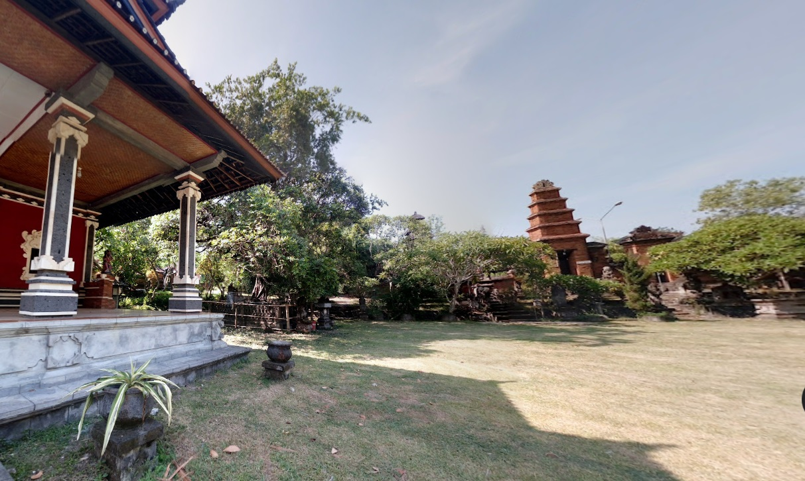

# 📖 Day 12: On the Twelfth Day of OSINT

- CTF: 25 Days of Christmas Capture the Flag.
- Organized by: [OSMOSIS Association](https://osmosisinstitute.org/).
- Release Date: December 12, 2024.
- Points: 125.

**Challenge:** When was this photo captured? (Month and Year)

Example format: `FLAG{Mar 1905}`

## ✍🏻 Write-Up

- The use of the `exiftool` command did not yield any useful information.
- Using Yandex Images, I identified the [location](https://commons.wikimedia.org/wiki/File:049_Unusual_Brick_Gateway,_The_Tanah_Lot_Area,_Tabanan,_Bali,_photograph_by_Anandajoti_Bhikkhu.jpg) depicted in the image.
- The site is the **Pura Luhur Pakendungan** in Bali, Indonesia.
- Attempts to find relevant photos elsewhere were unsuccessful.
- However, the solution was located on Google Street View. The image matches the scene captured in this [Street View link](https://www.google.com/maps/place/Pura+Luhur+Pakendungan/@-8.6155504,115.0868762,3a,75y,211.95h,82.49t/data=!3m8!1e1!3m6!1sAF1QipO9zoJkVBsrLGirBP3SlT39hQnqqJflGgSKmzif!2e10!3e11!6shttps:%2F%2Flh5.googleusercontent.com%2Fp%2FAF1QipO9zoJkVBsrLGirBP3SlT39hQnqqJflGgSKmzif%3Dw900-h600-k-no-pi7.508775916965547-ya123.95498784322564-ro0-fo100!7i7168!8i3584!4m6!3m5!1s0x2dd2377923a4fc3b:0xfac9500fb2a48d65!8m2!3d-8.6155625!4d115.0868906!16s%2Fg%2F11c5svkv_t?entry=ttu&g_ep=EgoyMDI0MTIxMS4wIKXMDSoASAFQAw%3D%3D).

## 🏁 Flag

`FLAG{Jan 2016}`. **Solved on:** December 12, 2024.