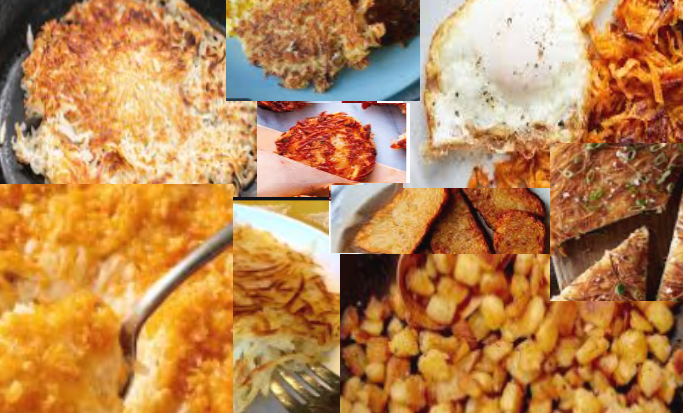

# 📖 Day 20: On the twentieth day of OSINT

- CTF: 25 Days of Christmas Capture the Flag.
- Organized by: [OSMOSIS Association](https://osmosisinstitute.org/).
- Release Date: December 20, 2024.
- Points: 275.

**Challenge:** They're all good, but **M**c**D**onalds has the best $**5** hash browns.

`FLAG{No format provided or Sanity Check}`

## ✍🏻 Write-Up

- The bold characters in the challenge prompt suggest evaluating the MD5 hash of the provided image.
- There are several methods to calculate an image's MD5 hash. One option is using online tools such as this [MD5 Calculator](https://md5file.com/calculator).
- After uploading the image, the tool generates the MD5 hash.

## 🏁 Flag

`FLAG{0e96b1c719d001156b60c23e645fd13a}`. **Solved on:** December 20, 2024.