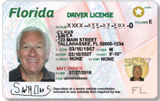

# 📖 Day 22: On the Twenty Second Day of OSINT

- CTF: 25 Days of Christmas Capture the Flag.
- Organized by: [OSMOSIS Association](https://osmosisinstitute.org/).
- Release Date: December 23, 2024.
- Points: 200.

**Challenge:** It turns out when he is not in the North Pole driving Rein Deer, he is on the streets of Florida Driving around. What is Santa's Drivers License Number?

`FLAG{XXXX-XXX-XX-XXX-0}`

## ✍🏻 Write-Up

- Initially, I mistakenly submitted `FLAG{S123-456-57-901-0}` based on this [site](https://www.wusf.org/transportation/2019-06-03/florida-drivers-licenses-see-more-changes) and the similarity with the image provided in the challenge. However, this response was incorrect.
- Upon further investigation, I discovered via [armadariskconsulting.com](https://www.armadariskconsulting.com/single-post/effective-strategies-for-finding-people) that Florida driver’s license numbers are generated using an algorithm combining a person’s name and date of birth.
    - The same site referenced an [online tool](http://www.highprogrammer.com/cgi-bin/uniqueid) capable of generating Florida driver’s license numbers. Using the tool, I input the following details:
        - First Name: Santa.
        - Last Name: Claus.
        - Gender: Male.
        - Date of Birth:
            - Year: 1957.
            - Month: 3.
            - Day: 15.
                - The result was: **C420-780-57-095-?**.

## 🏁 Flag

`FLAG{C420-780-57-095-0}`. **Solved on:** December 23, 2024.