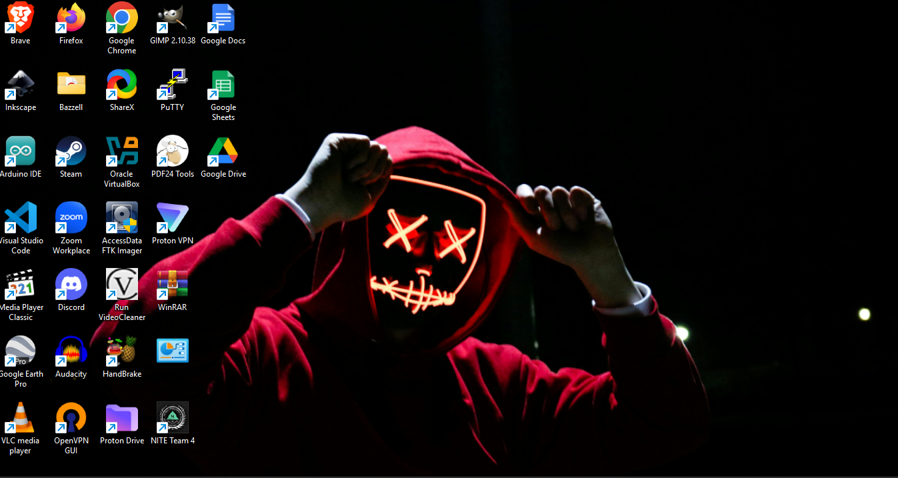

# 📖 Day 23: On the Twenty Third day of OSINT

- CTF: 25 Days of Christmas Capture the Flag.
- Organized by: [OSMOSIS Association](https://osmosisinstitute.org/).
- Release Date: December 24, 2024.
- Points: 225.

**Challenge:** This is a screen shot of my desktop. As you can see many of the folders have names, all except for one. What is this folder commonly refered to as?

`FLAG{Xxxxxxx Xxxxxx}`

## ✍🏻 Write-Up

- The icon closely resembles the Windows Control Panel but does not have a label underneath it.
- This corresponds to the **GodMode Folder**, a special Windows feature that allows users to access all Control Panel functions in a single folder.

## 🏁 Flag

`FLAG{Godmode Folder}`. **Solved on:** December 24, 2024.