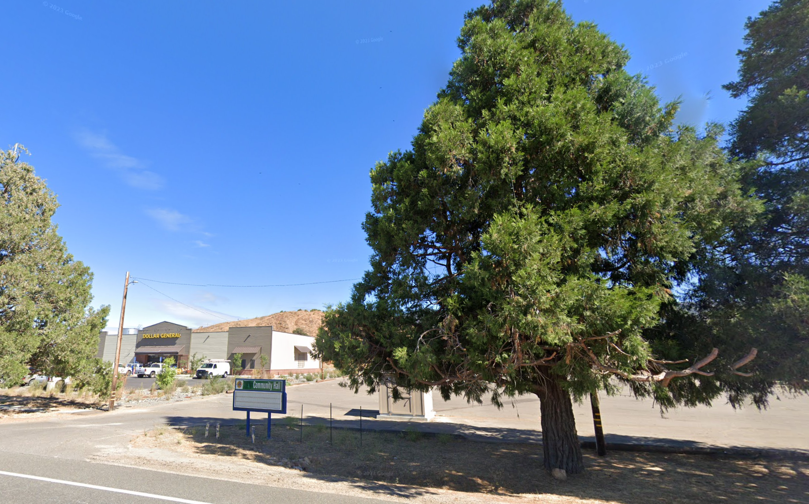
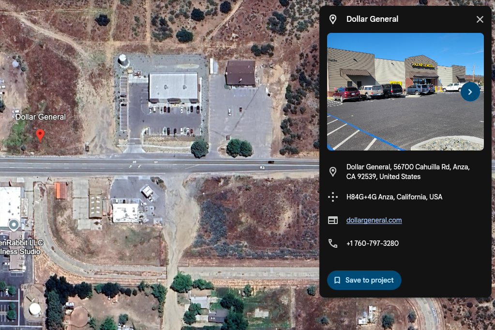
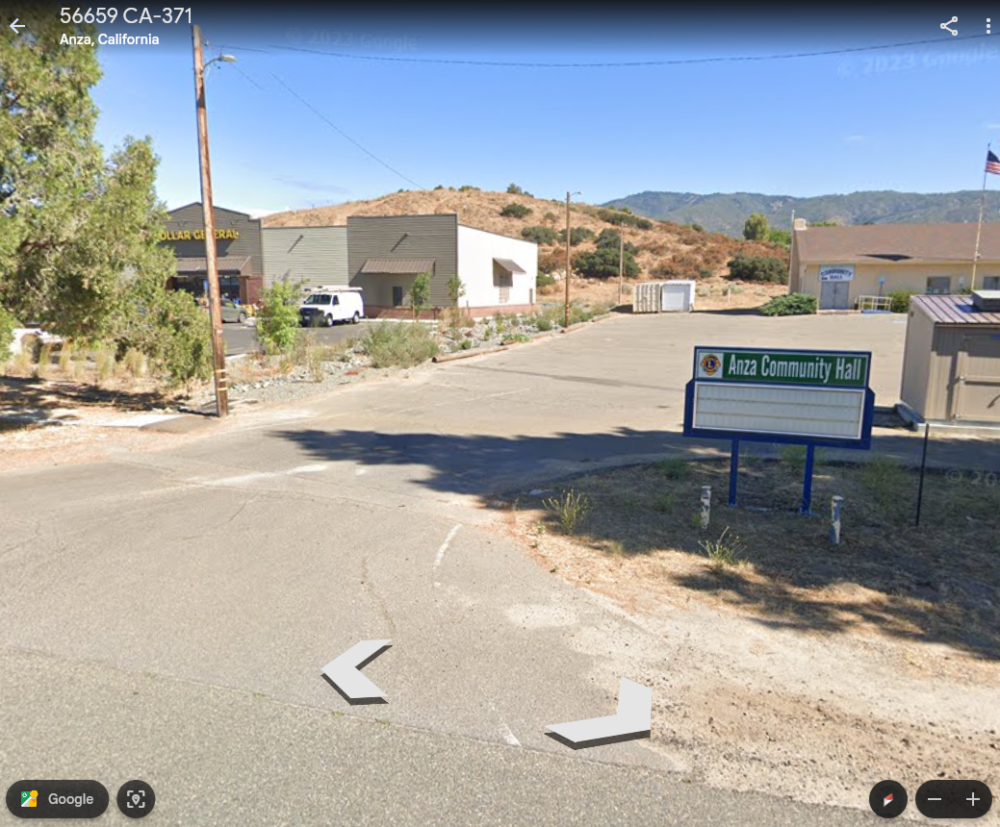

# 📖 Day 24: On the twenty fourth day of Osiint Pex gave us this

- CTF: 25 Days of Christmas Capture the Flag.
- Organized by: [OSMOSIS Association](https://osmosisinstitute.org/).
- Release Date: December 25, 2024.
- Points: 100.

**Challenge:** This Christmas Tree was lit up in the annual Christmas Tree Lighting Ceremony! Yet, there was a surprise extra-terrestrial guest in attendance...

What is the name of the alien this city is known for?

`FLAG{Xxxxxx}`

## ✍🏻 Write-Up

- To solve this challenge, exhaustive searches were conducted using Google and Google Earth, focusing on the following objectives:
    1. Identify annual Christmas Tree Lighting Ceremonies in the United States. However, this event occurs in numerous cities, making it challenging to narrow down the search.
    2. Search for "Dollar General" locations in arid/semi-arid U.S. states.
    3. Investigate "Community Hall" locations in arid/semi-arid U.S. states.
        - Unfortunately, these searches did not yield any useful results.
- Shifting the approach, I began exploring cities associated with UFO or alien-related events. This led to the discovery of [this site](https://myvalleynews.com/blog/2022/09/08/goldie-fest-delivers-interstellar-fun/), which mentions that the city of Anza has its very own UFO called **Goldie**.
    - Returning to Google Earth, I searched for "Dollar General" in Anza and identified the [location in the challenge image](https://earth.google.com/web/search/anza+dollar+general/@33.5553582,-116.67256767,1194.81255443a,492.23417369d,57.37434729y,-17.23835233h,32.8050587t,0.00000001r/data=CoIBGlQSTgolMHg4MGRiYTczZjU3YjUyZmIzOjB4OTUxYzEzNDlmZjJmNzk4ZRkmxjL9EsdAQCFEFmniHStdwCoTYW56YSBkb2xsYXIgZ2VuZXJhbBgBIAEiJgokCfNPp77MEklAEe0B_UXlC0lAGRgdFhEHul7AISlEYbPJvl7AQgIIAUICCABKDQj___________8BEAA).

## 🔎 Supporting Evidence

- Below are comparative images from the identified location:

## 🏁 Flag

`FLAG{Goldie}`. **Solved on:** December 25, 2024.