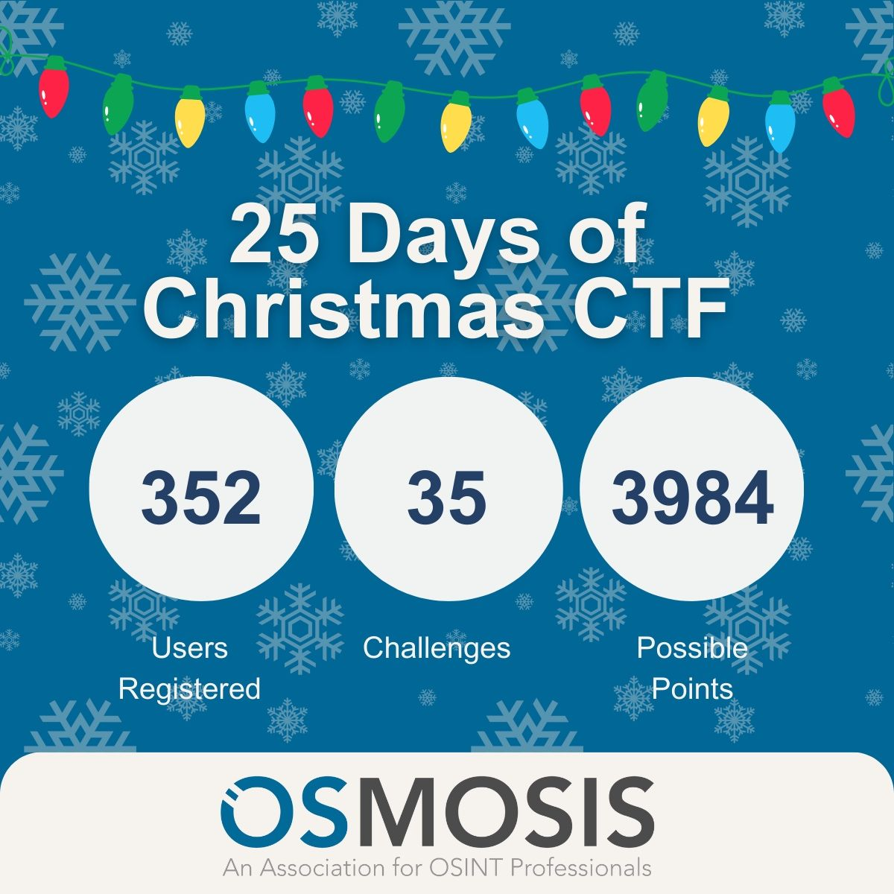
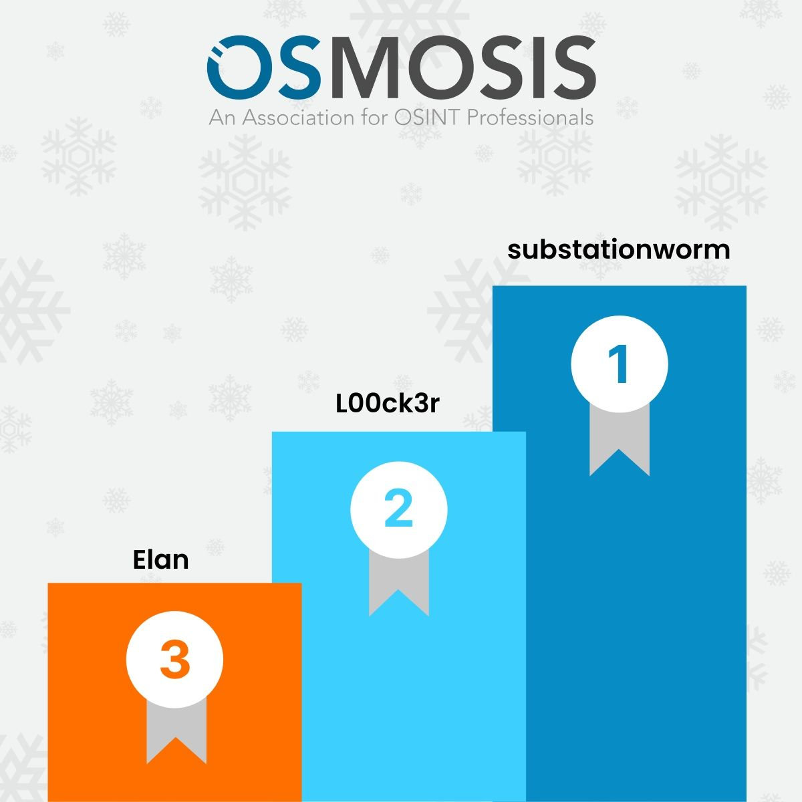

# 25 Days of Christmas Capture the Flag

Este é o repositório dos meus write-ups dos desafios propostos na 25 Days of Christmas Capture the Flag (CTF 🏁) organized by the [OSMOSIS Association](https://osmosisinstitute.org/) durante o mês de dezembro de 2024. This CTF brought together 352 registered competitors and tested skills in open-source intelligence (OSINT), digital forensics, geolocation, and reconnaissance.

Os write-ups dos desafios da CTF estão organizados da seguinte maneira:

- Day 01: On the First Day of OSINT.
- Day 02: On the Second Day of OSINT.
- Day 03: On the Third Day of OSINT.
- Day 04:
    - Day 04-01: On the Fourth Day of OSINT (1).
    - Day 04-02: On the Fourth Day of OSINT (2).
    - Day 04-03: On the Fourth Day of OSINT (3).
    - Day 04-Bonus: On the Fourth Day of OSINT (Bonus).
- Day 05: On the Fifth Day of OSINT.
- Day 06: On the Sixth Day of OSINT.
- Day 07: On the 7th Day of OSINT.
- Day 08: On the Eighth Day of OSINT.
- Day 09:
    - Day 09-01: On the Ninth Day of OSINT (1).
    - Day 09-02: On the Ninth Day of OSINT (2).
- Day 10: On the Tenth Day of OSINT.
- Day 11: On the Eleventh Day of OSINT .
- Day 12: On the Twelfth Day of OSINT.
- Day 13: On the Thirteenth Day of OSINT 
- Day 14:
    - Day 14: On the fourteenth day of osint.
    - Day 14-Real: The "Real" Fourteenth day of OSINT 
- Day 15: On the fifteenth day of OSINT.
- Day 16: On the Sixteenth Day of OSINT.
- Day 17: On the Seventeenth Day of OSINT.
- Day 18: On the eighteenth day of OSINT.
- Day 19: On the Nineteenth day of OSINT.
- Day 20: On the twentieth day of OSINT.
- Contestant Contributor: A Holiday Gift.
- Day 21:
    - Day 21-01. On the twnenty first day of OSINT (1).
    - Day 21-02: On the twenty first day of OSINT (2).
- Day 22: On the Twenty Second Day of OSINT.
- Day 23: On the Twenty Third day of OSINT.
- Day 24: On the twenty fourth day of Osint.
- A OSINT Bonus.
- Others:
    - Elf Bonus.
    - Elf Is Evil.
    - Elves Are Great!

Este repositório contém ainda outros arquivos auxiliares, como imagens utilizadas ao longo da competição, *scripts* e o histórico de notificações.

## Top Three Winners

---

*substationworm* . 2024-12-27

[Prof. Dr. Luiz F. Freitas-Gutierres](https://www.linkedin.com/in/lffreitas-gutierres/)