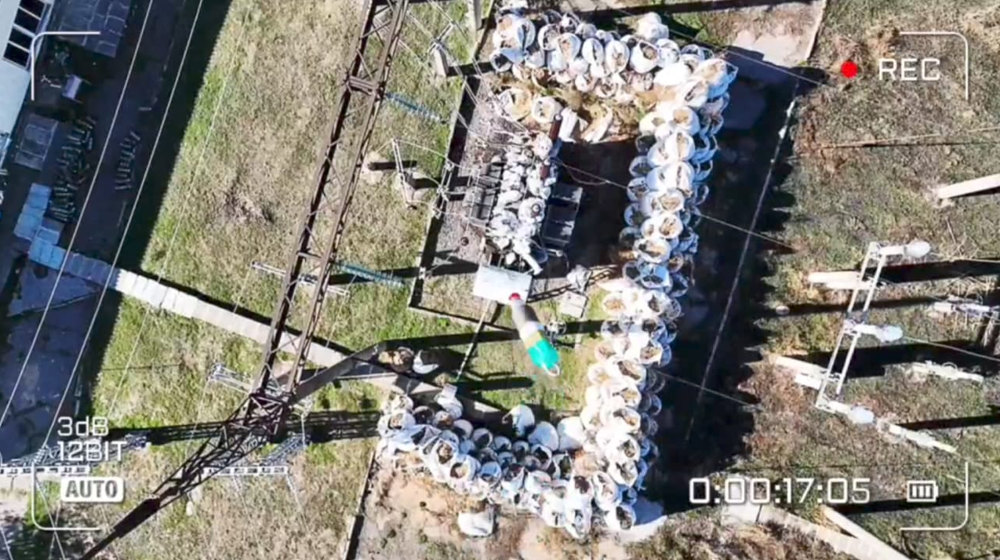
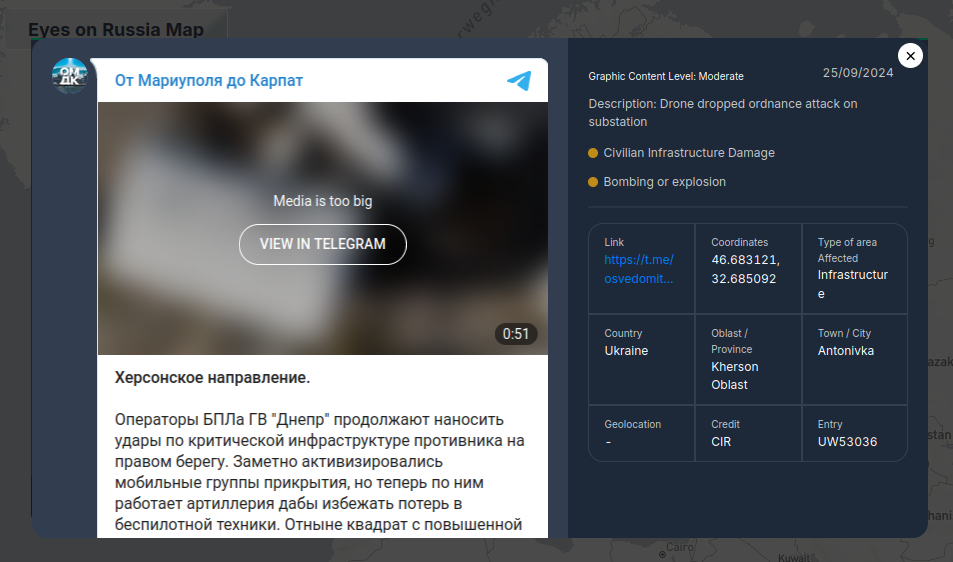
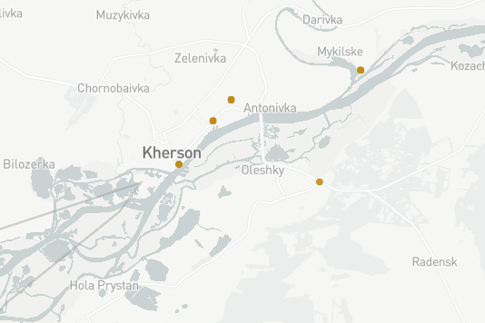
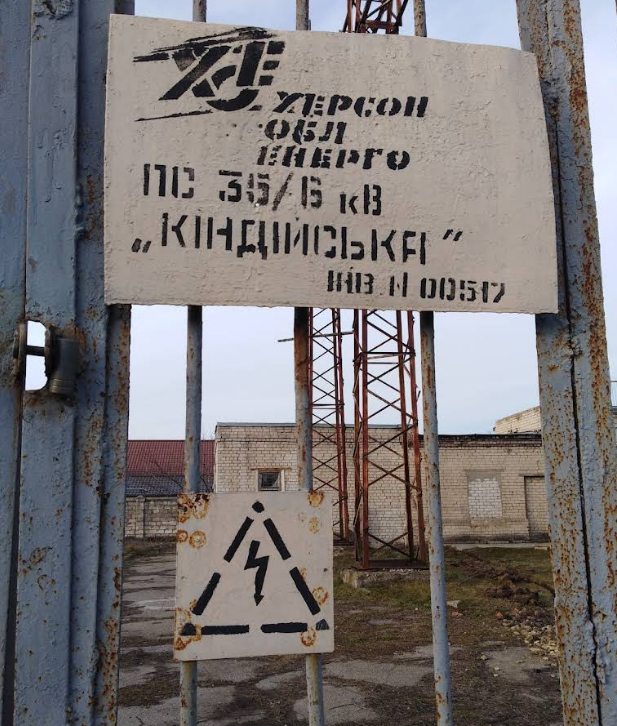

# 🗺️⚡ New Challenge (2025-03-16)

Dear OSINT investigator,

Your task consists of three distinct stages:

- 1️⃣ Identify the names of the suburb and the province where the targeted substation is located.
- 2️⃣ Determine the name of the substation.
- 3️⃣ Verify the voltage class of the substation (in kV).

Once you have gathered this information, you will be able to unlock the ZIP file and retrieve the flag.

## 🔐 ZIP File Password Format

- 🔒🎁 **File:** SubstationZIP.zip.
- `SuburbName-ProvinceName-SubstationName-XX/XX`.
- If any name consists of multiple words, omit the spaces between them.

## 🔍📚 Solution

- [Eyes on Russia Map (Entry UW53036)](https://www.eyesonrussia.org/event/UW53036?query=Substation&chosenOption=null%2Cnull%2Cnull&categories=&sectorAffected=&dateRange=1651546800000%2C1737946800000&onlyEventsMapFrame=false).
    - `Keyword = substation`.
    - `Category = Bombing or Explosion`.
    - `Sector affected = Infrastructure`.
        - Антонівка (Antonivka), Херсонська область (Kherson Oblast), Ukraine.
            - `SuburbName = Антонівка`.
            - `ProvinceName = Херсонськаобласть`.

- [Google Maps](https://maps.app.goo.gl/WM7qZa5sroa43Ydy7).
    - `SubstationName = Кіндійська`.
    - `VoltageClass = 35/6 kB`.
    - Company name: [Херсонобленерго](https://ksoe.com.ua/).
        - [Supporting evidence 01](https://miskrada-ks.gov.ua/wp-content/uploads/2021/07/s424-2021.pdf).
        - [Supporting evidence 02](https://www.ztoe.com.ua/xvii.php).

- **ZIP file password:** `Антонівка-Херсонськаобласть-Кіндійська-35/6`.